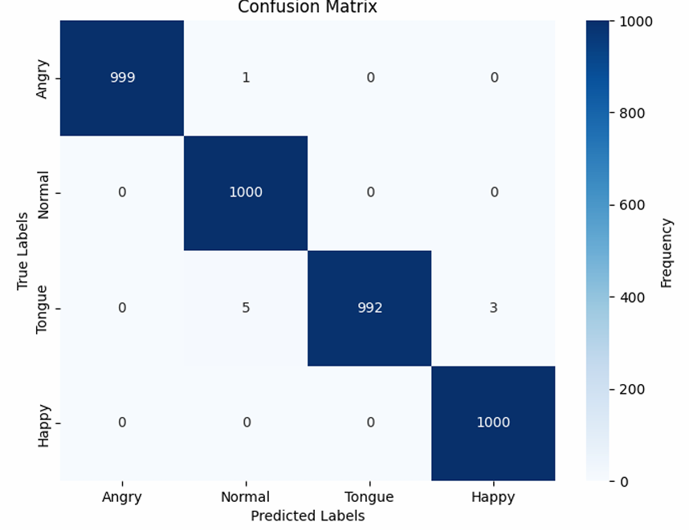
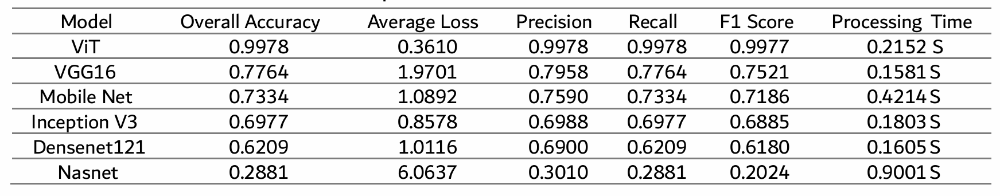

#  Facial Expression Classification Using Vision Transformers with Piecewise Fine-Tuning

This project implements a **high-performance facial emotion classifier** leveraging the **Vision Transformer (ViT)** architecture fine-tuned through a custom **piecewise training strategy**. The model classifies facial expressions into four categories: `angry`, `normal`, `tongue`, and `happy`.

We explore and evaluate a **multi-phase fine-tuning strategy**, and compare the model performance with leading CNN-based backbones like **VGG16**, **InceptionV3**, **DenseNet121**, **MobileNet**, **NASNet**, and  **Vision in Transformers**. Our piecewise-trained ViT achieved superior generalization performance.

---

##  Dataset Overview

* The dataset contains facial images of 4 emotional expressions:
  * `angry`
  * `normal`
  * `tongue out`
  * `happy`

##  Piecewise Fine-Tuning Strategy

The core of this training pipeline is the **piecewise fine-tuning strategy**, where training is explicitly split into **two disjoint phases**:

### 🔹 Phase 1: Pretraining on Augmented Data
* The ViT model is **trained exclusively on brightness-augmented images**.
* No exposure to clean (original) samples.
* Teaches the model to **generalize across lighting conditions** and learn invariant low-level patterns.

### 🔹 Phase 2: Fine-Tuning on Clean Data
* Model is **fine-tuned on clean, original dataset**.
* Helps the model specialize in fine-grained facial cues **without overfitting** on lighting artifacts.

---

##  Model Architecture & Components

| Component        | Details                                                                  |
| ---------------- | ------------------------------------------------------------------------ |
| Backbone Model   | `ViTForImageClassification` from HuggingFace Transformers                |
| Pretrained Model | `dima806/facial_emotions_image_detection`                                |
| Image Processor  | `ViTImageProcessor` — resizing, normalization, and tokenization          |
| Input Size       | 224x224 RGB                                                              |
| Labels           | `{'angry': 0, 'normal': 1, 'tongue': 2, 'happy': 3}`                     |
| Loss Function    | **Cross-Entropy Loss** — standard for multi-class classification         |

###  Why Cross-Entropy Loss?
Penalizes incorrect predictions proportionally to the confidence of the model. Ideal for single-label classification.

## Preprocessing Pipeline

* Images are converted to RGB using `PIL`.
* Preprocessed with `ViTImageProcessor`:
  * Resize to 224x224
  * Normalization (ImageNet stats)
  * Converts to PyTorch tensors

* Tensors saved to disk as `.pt` files to improve memory efficiency.

###  DiskImageDataset
A PyTorch `Dataset` that:
* Loads tensors from disk
* Returns `pixel_values` and corresponding `labels`

---

##  Training Details

| Hyperparameter         | Value                                  |
| ---------------------- | -------------------------------------- |
| Batch Size             | 32                                     |
| Optimizer              | AdamW                                  |
| Weight Decay           | Enabled (default)                      |
| Loss Function          | CrossEntropyLoss                       |
| Train/Test Split       | 80% / 20%                              |
| Learning Rate          | HuggingFace default                    |

###  Model Saving Logic

A custom callback (`CustomSaveModelCallback`) saves models during evaluation:
* Filename includes epoch and eval accuracy.
* Example: `model_epoch_2.00_acc_0.9235.bin`

---

##  Evaluation Metrics

The confusion matrix shows high performance on validation test data indicating High accuracy

and in the following table it can be seen how ViT effectively outperformed all of the other cnn archetitures

---

## Libraries Used

* `torch`, `torchvision`
* `transformers` (by HuggingFace)
* `PIL`, `os`, `glob`, `pandas`
* `scikit-learn`
* `transformers`
---

##  Summary

**Piecewise fine-tuning with ViT** is highly effective for boosting generalization when training on augmented data. By initially training on difficult examples, then fine-tuning on clean ones, the model gradually shifts from robustness to specialization.

